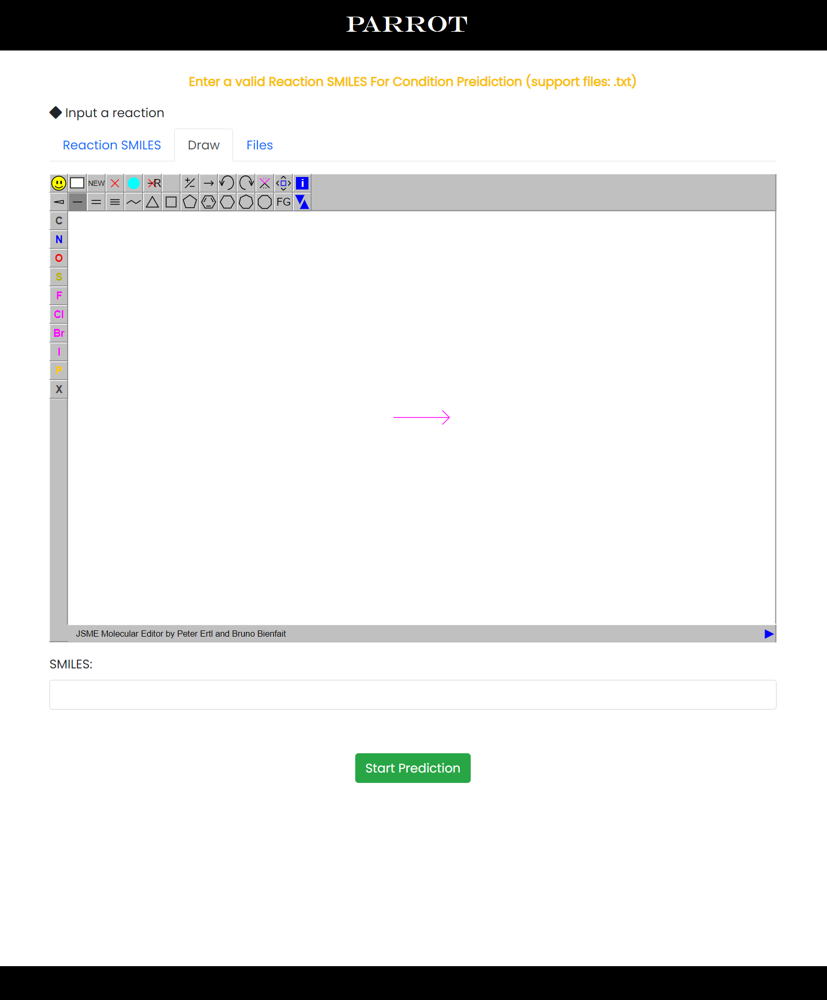
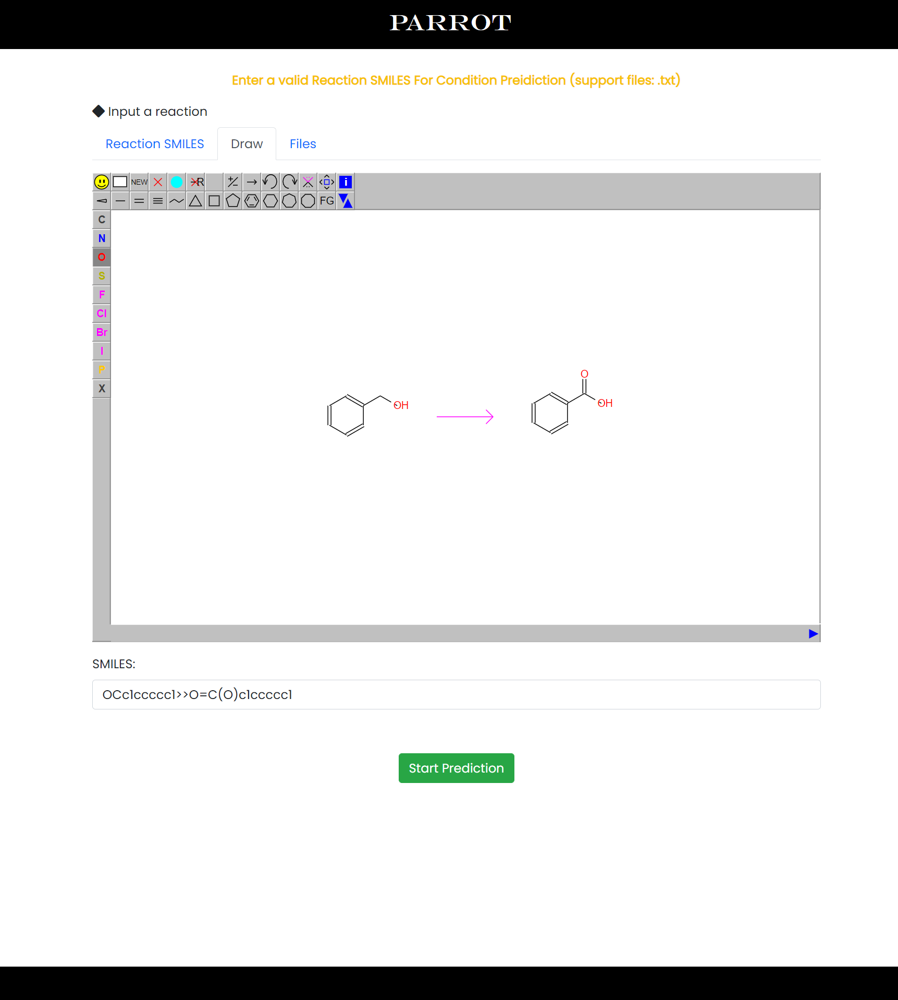
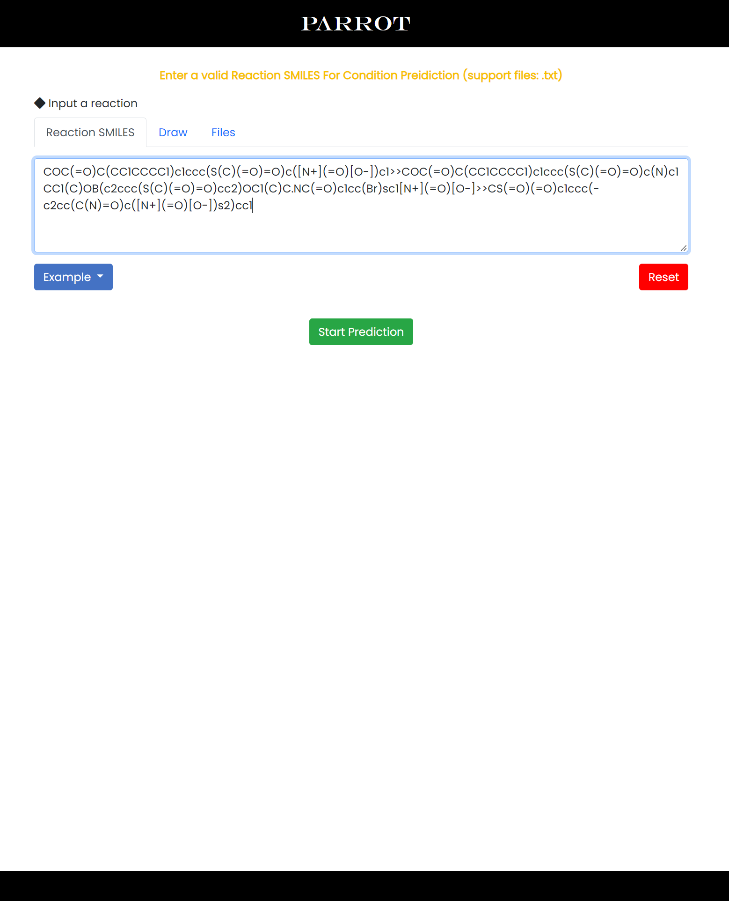
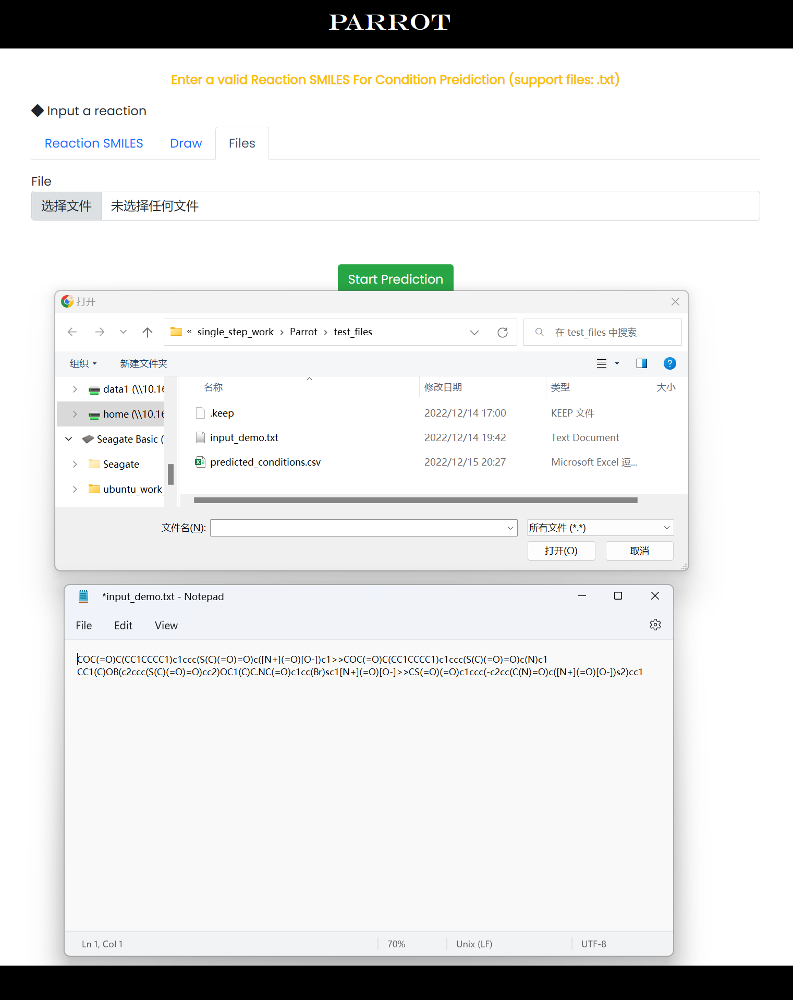

# Parrot
 <br>
Implementation of reaction condition prediction with Parrot<br><br>


## Contents

- [Publication](#publication)
- [Quickly Start From Gitpod](#quickly-start-from-gitpod)
- [OS Requirements](#os-requirements)
- [Python Dependencies](#python-dependencies)
- [Installation Guide](#installation-guide)
- [Use Parrot](#use-parrot)
    - [Command](#command)
    - [Web Interface](#web-interface)
- [Reproduce the results](#reproduce-the-results)
    - [Get Dataset](#1-get-dataset)
    - [Pretrain](#2-pretrain)
    - [Train Parrot](#3-train-parrot)
    - [Test Parrot](#4-test-parrotparrot)
- [Cite Us](#cite-us)

## Publication
Xiaorui Wang, Chang-Yu Hsieh*, Xiaodan Yin, Jike Wang, Yuquan Li, Yafeng Deng, Dejun Jiang, Zhenxing Wu, Hongyan Du, Hongming Chen, Yun Li, Huanxiang Liu, Yuwei Wang, Pei Luo, 
Tingjun Hou*, Xiaojun Yao*. Generic Interpretable Reaction Condition Predictions with Open Reaction Condition Datasets and Unsupervised Learning of Reaction Center. *Research*
2023;6:Article 0231. DOI:[10.34133/research.0231](https://spj.science.org/doi/10.34133/research.0231)

## Quickly Start From Gitpod
About 4 minutes.<br>
[](https://gitpod.io/#https://github.com/wangxr0526/Parrot) 


## OS Requirements
This repository has been tested on **Linux**  operating systems.

## Python Dependencies
* Python (version >= 3.7) 
* PyTorch (version >= 1.10.0) 
* RDKit (version >= 2019)
* Transformers (version == 4.18.0)
* Simpletransformers (version == 0.63.6)

## Installation Guide
Create a virtual environment to run the code of Parrot.<br>
It is recommended to use conda to manage the virtual environment.The installation method for conda can be found [here](https://conda.io/projects/conda/en/stable/user-guide/install/linux.html#installing-on-linux).<br>
Make sure to install pytorch with the cuda version that fits your device.<br>
This process usually takes few munites to complete.<br>
```
git clone https://github.com/wangxr0526/Parrot.git
cd Parrot
conda env create -f envs.yaml
conda activate parrot_env
pip install gdown wtforms flask flask_bootstrap
```


## Use Parrot
You can use Parrot to predict suitable catalysts, solvents and reagents, and temperatures for reactions. <br>
**First** download the model and datasest files by this command:<br>
```
python preprocess_script/download_data.py
```
The links correspond to the paths of the zip files as follows:
```
https://drive.google.com/uc?id=1aX70qzZrJ9TZ9KpqnvUVR8WBxiTwXOsI    --->    dataset/source_dataset/USPTO_condition_final.zip

https://drive.google.com/uc?id=1uEqpkF4tPTlLIPdTyWJdXows7hKQbAAc    --->    dataset/pretrain_data.zip

https://drive.google.com/uc?id=1gFV2KdVKaLCTeb3nrzopyYHXbM0G_cr_    --->    outputs/Parrot_train_in_USPTO_Condition_enhance.zip

https://drive.google.com/uc?id=1bVB89ByGkYjiUtbvEcp1mgwmoKy5Ka2b    --->    outputs/best_rcm_model_pretrain.zip

https://drive.google.com/uc?id=1DmHILXSOhUuAzqF0JmRTx1EcOOQ7Bm5O    --->    outputs/best_mlm_model_pretrain.zip
```


We provide two usage methods, one is to use the command line, and the other is through the web interface.
### Command
Then prepare the txt file containing the SMILES of the reactions you want to predict, and enter the following command:<br>
```
cd Parrot
python inference.py --config_path path/to/config_file.yaml \
                    --input_path path/to/input_file.txt \
                    --output_path path/to/output.csv \
                    --num_workers NUM_WORKERS \
                    --inference_batch_size BATCH_SIZE \
                    --gpu CUDA_ID          # use cpu: CUDA_ID=-1
```
For example, using Parrot predictions trained on the USPTO-Condition dataset, use the following command:<br>
```
python inference.py --config_path configs/config_inference_use_uspto.yaml \
                    --input_path test_files/input_demo.txt \
                    --output_path test_files/predicted_conditions.csv \
                    --num_workers 6 \
                    --inference_batch_size 8 \
                    --gpu 0
```
Or using Parrot predictions trained on the Reaxys-TotalSyn-Condition dataset, use the following command:<br>
```
# Could be used to predict temperatures.
python inference.py --config_path configs/config_inference_use_reaxys.yaml \
                    --input_path test_files/input_demo.txt \
                    --output_path test_files/predicted_conditions.csv \
                    --num_workers 6 \
                    --inference_batch_size 8 \
                    --gpu 0
```

### Web Interface
Use this command to run web interface.
```
cd web_app
python app.py
```
Open the browser, enter: http://127.0.0.1:8000 and you will see the following interface:<br><br>
<br>
Support three input methods<br>

#### Draw
<br>



#### Reaction SMILES
<br>



#### TXT Files
<br>



## Reproduce the results

### **[1]** Get Dataset
The complete processed **USPTO-Condition**, **USPTO-Suzuki-Condition** and pretrain dataset after **USE Parrot** is already in `dataset/source_dataset/USPTO_condition_final` and `dataset/pretrain_data`, if you want to recreate the USPTO-Condition dataset, you can read [here](./preprocess_script/uspto_script/uspto_condition.md). If you want to use Reaxys-TotalSyn-Condition, you can only process it from scratch. We provide the ReaxysID of the data and the script for processing. For details, you can read [here](./preprocess_script/reaxys_script/reaxys_totalsyn_condition.md).The final `dataset` directory structure should be as follows:
```
dataset/
├── pretrain_data
│   ├── mlm_rxn_train.txt                # MLM pretrain dataset (train)
│   ├── mlm_rxn_val.txt                  # MLM pretrain dataset (validation)
│   ├── rxn_center_modeling.pkl          # RCM pretrain dataset (train + validation)
│   └── vocab.txt                        # Parrot reaction SMILES vocabulary
└── source_dataset
    ├── Reaxys_total_syn_condition_final
    │   ├── Reaxys_total_syn_condition.csv
    │   ├── Reaxys_total_syn_condition_alldata_idx.pkl
    │   └── Reaxys_total_syn_condition_condition_labels.pkl
    └── USPTO_condition_final
        ├── canonical_pistachio_label.json
        ├── condition_replace_dict_final.json
        ├── USPTO_condition_alldata_idx.pkl
        ├── USPTO_condition_aug_n5_alldata_idx.pkl
        ├── USPTO_condition_aug_n5_condition_labels.pkl
        ├── USPTO_condition_aug_n5.csv
        ├── USPTO_condition_condition_labels.pkl
        ├── USPTO_condition.csv
        ├── USPTO_condition_pred_category.csv
        └── USPTO_condition_pred_category_org.csv


```

### **[2]** Pretrain
- Masked Language Modeling pretrain:
    ```
    python pretrain_mlm.py --gpu CUDA_ID --config_path configs/pretrain_mlm_config.yaml
    ```
- masked Reaction Center Modeling pretrain:
    ```
    python pretrain_rcm.py --gpu CUDA_ID --config_path configs/pretrain_rcm_config.yaml
    ```

After pretraining, you will get `best_mlm_uspto_pretrain` and `best_rcm_uspto_pretrain` containing model state in `outputs`.

### **[3]** Train Parrot
Training in the USPTO-Condition dataset:
- Parrot-ML
    ```
    python train_parrot_model.py --gpu CUDA_ID --config_path configs/config_uspto_condition.yaml
    ```
- Parrot-ML-E
    ```
    python train_parrot_model.py --gpu CUDA_ID \
                                --config_path configs/config_uspto_condition_aug_n5_lr_low.yaml
    ```

Training in the Reaxy-TotalSyn-Condition dataset:
- Parrot-RCM
    ```
    python train_parrot_model.py --gpu CUDA_ID \
                                 --config_path configs/config_reaxys_totalsyn_condition.yaml
    ```
### **[4]** Test Parrot
Test in the USPTO-Condition dataset:
- Parrot-ML-E
    ```
    python test_parrot_model.py --gpu CUDA_ID \
                                --config_path configs/config_uspto_condition_aug_n5_lr_low.yaml
    ```
Test in the Reaxy-TotalSyn-Condition dataset:
- Parrot-RCM
    ```
    python test_parrot_model.py --gpu CUDA_ID \
                                --config_path configs/config_reaxys_totalsyn_condition.yaml
    ```
## Cite Us
```
@article{
doi:10.34133/research.0231,
author = {Xiaorui Wang  and Chang-Yu Hsieh  and Xiaodan Yin  and Jike Wang  and Yuquan Li  and Yafeng Deng  and Dejun Jiang  and Zhenxing Wu  and Hongyan Du  and Hongming Chen  and Yun Li  and Huanxiang Liu  and Yuwei Wang  and Pei Luo  and Tingjun Hou  and Xiaojun Yao },
title = {Generic Interpretable Reaction Condition Predictions with Open Reaction Condition Datasets and Unsupervised Learning of Reaction Center},
journal = {Research},
volume = {6},
pages = {0231},
year = {2023},
doi = {10.34133/research.0231},
URL = {https://spj.science.org/doi/abs/10.34133/research.0231},
eprint = {https://spj.science.org/doi/pdf/10.34133/research.0231},
}
```